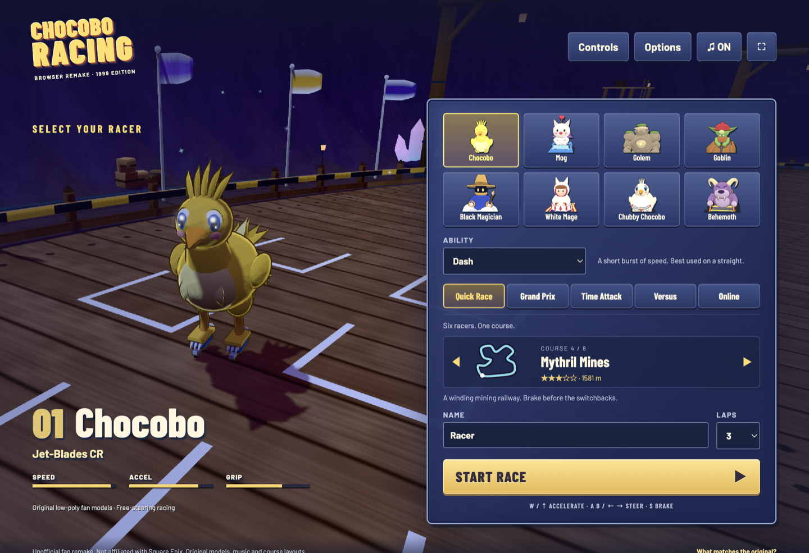
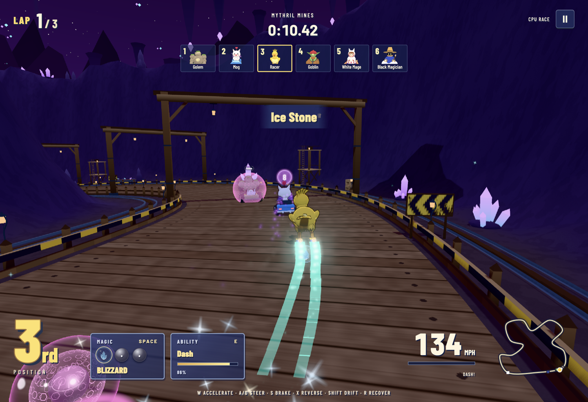

# Chocobo Racing browser remake

A free, open-source racing game that aims to recreate the feel of old-school games like Chocobo Racing using modern web technologies. Built with TypeScript, Three.js, WebGL, Node.js and Socket.IO, it runs in the browser and supports local races and private online rooms.

This playable, unofficial fan interpretation of the 1999 PlayStation racer has free driving, eight character/vehicle models and an original-style Magic Stone system.

[Repository](https://github.com/SainyTK/chocobo-racing-threejs) · [MIT license](LICENSE)

[Play in your browser](https://chocobo-racing-threejs-production.up.railway.app/), or follow the instructions below to play locally.

The public server uses Railway's free credits. It can sleep when idle and may be unavailable when credits run out. Rooms disappear when the server sleeps, restarts or deploys.

This is not an identical port. Models, music, animations, maps and physics tuning are newly authored. Character and course names reference Square Enix's game. No original game files are bundled or required. The project is not affiliated with Square Enix.

## Screenshots

Captured from the running game with Orca's embedded browser.

### Racer selection



### Racing in Mythril Mines



## Play

Requires Node.js 22.12 or newer and WebGL 2.

```sh
git clone https://github.com/SainyTK/chocobo-racing-threejs.git
cd chocobo-racing-threejs
npm ci
npm run dev
```

Open http://localhost:3000.

- Quick Race: six racers on the selected course, with CPU opponents.
- Grand Prix: four courses, cumulative points, changing grids and a final champion.
- Time Attack: solo racing without stones. Your best race saves a Phantom Racer in this browser.
- Versus: one-on-one racing against a selected CPU rival.
- Online: private six-player rooms. Empty positions use CPU racers. Share the six-character code or invite link.

Choose among eight racers and eight courses. Abilities are independent of character choice. Lap count is configurable from one to three. Grand Prix starts on your selected course and continues through the next three in course order.

### Driving

Manual acceleration is on by default. You must steer around corners. The game does not guide your heading along the road. Brake before tight turns; use boosts on straights. Options includes auto-accelerate, which does not steer for you.

| Action | Keyboard | Touch / standard gamepad |
| --- | --- | --- |
| Accelerate | W or up arrow | GAS / right trigger |
| Steer | A/D or left/right arrows | Arrows / left stick |
| Brake | S or down arrow | BRAKE / left trigger |
| Reverse | X | REV / B |
| Drift | Shift while steering, or accelerator + brake | DRIFT / A |
| Cast latest stone | Space | MAGIC / X |
| Ability | E | ABILITY / Y |
| Recover | R | RECOVER button |
| Look behind | B | LOOK button |
| Race menu | Escape | Pause button |

A long drift causes a spin, not a release turbo. Release the pedals during an over-drift spin, then press accelerate to perform a Spin Dash. A timed accelerator press just before GO gives a dash start.

Carry up to three stacks of Magic Stones, trailing in a line behind your racer.
A stone that matches your latest stack merges into it, up to level three, so it frees a slot for another pickup.
Level two and three stacks glow, and level three blazes.
The latest stack casts first, at its full level.
Reflect and Doom never merge.
Reflect can defend automatically while held.
Drive into a rival's trailing stack to take it.
A collision can pass a Doom curse.

Local menus pause the race. Online rooms continue running. Disconnected online racers get CPU control and can reconnect within 60 seconds, including after a page reload.

### Music

Each of the eight courses has its own newly composed, multi-part synthesized music loop inspired by the 1999 soundtrack's course themes. Menus use a separate tune. Local race pauses stop the music; online race menus do not pause it. The sound toggle controls both music and effects.

Music starts after a click, tap or driving key because browsers require a user gesture. No original recordings or transcribed game melodies are bundled. See [stage music references and composition notes](docs/stage-music-reference.md).

## Play on another device

The server listens on `0.0.0.0`. Use this computer's LAN IP on devices on the same network, for example `http://192.168.1.20:3000`. Open the LAN address before copying an invite. A localhost link cannot reach another computer. Allow the port through the host firewall.

For temporary internet play without deployment, use the tunnel setup below. For permanent hosting, deploy the Node server on a reachable HTTPS host with WebSocket support. Static-file hosting alone is insufficient.

### Test online multiplayer locally with cloudflared

A Cloudflare Quick Tunnel gives this computer's game server a temporary public HTTPS URL. Teammates can join from computers or phones on different networks without deploying to Railway. The host computer must stay awake with the command running. This tests internet play through the host computer and Cloudflare, not the production Singapore Railway route.

Install Node.js 22.12 or newer and [cloudflared](https://developers.cloudflare.com/tunnel/downloads/). Quick Tunnel instructions and limitations are in [Cloudflare's documentation](https://developers.cloudflare.com/tunnel/get-started/quick-tunnels/). On macOS with Homebrew, install it with `brew install cloudflared`.

1. In the repository checkout you want to test, run:

   ```sh
   npm run tunnel
   ```

   Run `npm ci` first if dependencies are not installed. This command checks for cloudflared and a free port, builds the game, starts the production server on port `3219`, and opens the tunnel. No second terminal or manual origin configuration is needed. It uses the server's same-origin check for multiplayer, overriding any inherited `ALLOWED_ORIGINS` setting for this test session.

   To use another port, run `PORT=3000 npm run tunnel`. If the port is occupied, the command stops rather than exposing another server.

2. Copy the actual `https://...trycloudflare.com` URL printed by cloudflared. It changes whenever the tunnel restarts. Keep the command running.

3. Open the same tunnel URL on every device. Choose **Online**, create a room on one device, then join its six-character room code on the others. Open the tunnel URL before copying an invite; a localhost invite does not work on a teammate's phone. With two players, the remaining four racers are CPU-controlled. On a phone, push the joystick up or diagonally to drive. The right-side buttons use items, activate the selected ability, and drift. Use mobile data on the phone to test separate internet connections, or the same Wi-Fi for a same-network test through the tunnel.

4. Optionally append `/?netPerf` to the tunnel URL to collect bounded frame/network diagnostics. Do not add `netDelay`, `netJitter` or `netDrop` for a real-connection test. Desktop Chrome's developer console can copy the telemetry with:

   ```js
   copy(JSON.stringify(window.__raceDebug.network))
   ```

   Record the device/browser, graphics setting and connection type alongside the telemetry. Try normal play without diagnostics too. See [multiplayer measurements and test methodology](docs/multiplayer-performance.md).

Share the temporary URL only with the test team; anyone with it can access the local game service. This is a testing tunnel, not permanent hosting. When finished, press Ctrl+C to stop the server and cloudflared. Cancellation during the build also stops the build processes. If the server or tunnel exits unexpectedly, the command stops the other process too. No Railway deployment, paid service or billing change is needed.

## Studio

The studio is an internal viewer for game elements: racers, Magic Stones, spell effects, stage objects, whole courses and music.

```sh
npm run studio
```

It opens http://localhost:5180 with its own Vite server, separate from the game server.
The production build does not include it.

To listen without opening the game, search for `music` or scroll to the Music category. Select one of the eight courses or Menu music, then press **Play music**. Each preview shows its composition title, tempo, loop length and playback progress, with pause, restart and volume controls. Only the active comparison pane plays audio. Switching to a non-music element stops playback. The toolbar's Pause and Restart also control music; animation speed does not change its tempo. Shared links and page reloads never autoplay.

Search the library with `/` (or Cmd/Ctrl+K), then press Enter to show the highlighted element in the active pane.
Shift+Enter adds it as a new pane.
Compare up to four panes side by side, each with its own element and variant, labelled A to D.
`V` (or "All variants") fills the panes with the variants of the active element, and `[` / `]` step through variants.
Linked cameras turn every pane together, and Restart replays every pane from the same moment.
Variants marked "In game" are what the game currently uses.

The address bar always holds the full comparison, so "Copy link" shares exactly what you see.
"Save image" downloads all panes as one PNG with each pane's letter, element and variant, ready to post for a decision.
Quality switches between the game's High and Low settings.

The Courses category builds a complete course in a pane, lit by its own sky, fog and sun.
"Race camera lap" drives a Chocobo round the course behind the game's chase camera; drag to look around it and scroll to pull back.
"Aerial overview", "Start line" and the six "Trackside" views orbit fixed points of the course.
"Prop sheet" lays out the course's named props side by side with labels, for working on one prop at a time.
Course files hot-reload, so scenery can be built and judged here without starting a race.

To register a new element, add an entry under `studio/elements/` and list it in `studio/registry.ts`.

## Course scenery

Each course's look lives in one file under `src/gfx/stage/courses/`: its sky, fog and light, terrain shape and colour, road surface, start gate colours, ambient particles, a `build` function that places everything else, and a catalog of props for the studio's prop sheet.
`src/gfx/stage/kit.ts` collects props in world space and merges them per 128 m chunk and material layer, so the camera culls whole sections and a course draws in a few hundred calls.
Props are authored as `Parts`: geometry painted per vertex with baked ambient occlusion, on a solid, wind-swayed foliage or glowing layer.
Small dressing marked `detail` disappears on Low quality.

`npx tsx tests/stage-report.ts [ids] [--props]` prints build time and triangle counts per course, and with `--props` the cost of every catalog prop.
`tests/stage.test.ts` builds every course headless and checks budgets, disposal, Low-quality detail hiding, and that nothing stands on the road between the surface and 9 m overhead, where the chase camera rides.

## Production

```sh
npm run build
ALLOWED_ORIGINS=https://racing.example.com PORT=3000 npm start
```

`ALLOWED_ORIGINS` accepts comma-separated exact origins. Without it, the server accepts matching Origin/Host pairs. Set it explicitly behind a reverse proxy and forward WebSocket upgrades.

```sh
docker build -t chocobo-racing .
docker run --rm -p 3000:3000 \
  -e ALLOWED_ORIGINS=http://localhost:3000 \
  chocobo-racing
```

`GET /health` reports health, rooms and connections. The server is a single process with in-memory rooms. Restarting it clears rooms. Do not run unsynchronized replicas. Public hosting also needs infrastructure rate limiting and monitoring.

## Deployment

The public deployment is a single Railway service in Singapore that serves both `dist/` and the authoritative multiplayer server. The existing Dockerfile builds and starts both. No database is required.

The Railway project is `hearty-analysis`, service `chocobo-racing-threejs`, environment `production`. GitHub auto-deployment is connected to `main`. It uses one replica, `/health` for deployment checks, and idle sleeping. `ALLOWED_ORIGINS` is `https://chocobo-racing-threejs-production.up.railway.app`.

Hosting stays on the free Trial, which automatically reverts to the Free plan with $1 monthly credit [3]. No paid subscription was created. Uptime depends on available credits. Idle sleeping reduces usage but active multiplayer connections can keep the server awake.

Railway detects a repository Dockerfile automatically [1]. Use the repository root, branch `main`, one replica, a public HTTPS domain and healthcheck path `/health`. The server listens on `0.0.0.0` and reads Railway's `PORT` variable [2]. Set `ALLOWED_ORIGINS` to the exact public page origin, without a trailing slash. Add any custom-domain origin as another comma-separated value. Rooms live in memory and disappear on restart or deployment.

Vercel can host the Vite frontend with build command `npm run build` and output directory `dist`. However, this is not a complete multiplayer deployment as written. `src/network.ts` currently connects to the page's own origin. A split Vercel/Railway deployment needs a configurable backend URL and cross-origin Socket.IO configuration on the server, including polling CORS. Vercel preview origins also need an explicit policy. Keep the current long-running simulation and room state on Railway unless the backend is redesigned.

### What to provide before deployment

- Choose Railway-only, or Vercel frontend plus Railway backend. Railway-only needs no frontend/backend split.
- Confirm the Railway workspace, project, environment and service name. Say whether to create a new project or use an existing one, and provide its ID or dashboard URL if it exists.
- Authenticate Railway locally through its CLI, or connect Railway to GitHub and authorize access to this repository. Registration alone does not grant deployment access.
- Specify the region nearest your players, an approved monthly hosting budget, and whether pushes to `main` should deploy automatically.
- Choose a provider-generated domain or supply your custom domain and confirm you can edit its DNS.
- If using Vercel, also supply the team/account scope and project name or existing project ID. Run `vercel login` locally and authorize GitHub access if using Git-based deployments.
- Explicitly approve creating services or additional deployments. Do not upgrade the existing deployment to a paid plan without approval.

Do not paste account passwords, API tokens or session cookies into chat. Sign in locally or store required credentials through the provider's secure settings. This game currently needs no third-party API keys.

### Deployment sources

[1] [Railway services and Dockerfile detection](https://docs.railway.com/services)

[2] [Railway healthchecks and the PORT variable](https://docs.railway.com/deployments/healthchecks)

[3] [Railway Free Trial and transition to the Free plan](https://docs.railway.com/pricing/free-trial)

## Tests

```sh
npm test
npm run check
npm run build
npx playwright install chromium
npm run test:e2e
npm run test:production
npm run test:studio

# Optional WebKit compatibility check, with the dev server running
npx playwright install webkit
node tests/compatibility-smoke.mjs
```

Browser tests drive complete races by reading cloned telemetry and sending keyboard or touch events. They do not set racer positions, call simulation functions or accelerate the game clock. The full suite includes all eight courses, four Grand Prix rounds, saved ghosts, mobile controls and two-client multiplayer.

Reports are in `output/playwright-report/`; screenshots are in `output/testing/` with a `v2-` prefix. Vite ignores generated reports so tests do not reload other live races. `docs/testing.md` records completed validation and limitations.

## Code

- `shared/math.ts`: clamp, modulo and angle helpers shared by the simulation and the client.
- `shared/track/`: eight closed circuits (`tracks.ts`), road sampling and world-to-road projection (`sampling.ts`), and stones, boost pads and hazards (`objects.ts`).
- `shared/game/`: 60 Hz free driving, bots, spells, abilities, collisions and validated laps.
  Settings and data live in `constants.ts`, `abilities.ts`, `items.ts` and `racers.ts`.
  Race setup is in `setup.ts`, spell hits in `combat.ts`, item and ability use in `actions.ts`, and the bot driver in `bot.ts`.
  `step/` runs one tick: per-racer physics, projectiles, racer contacts and standings.
- `server/index.ts`: authoritative room server, sessions and input validation.
- `src/scene.ts`: chase camera, course loading, pickups, shadows, bloom post-processing and 3D-rendered portraits.
- `src/gfx/characters/`: the eight rigged racers and vehicles, built in code with cel shading and outlines, with running, flapping, blinking and spring animations.
  `index.ts` builds a racer by index, `rig.ts` batches parts into few draw calls, `parts/` holds shared pieces (bird body, eyes, wheels, carpet texture) and `racers/` has one file per racer.
- `src/gfx/effects/`: spell and race effects: fireballs, ice traps, lightning, Ultima, Reflect bubbles, Doom runes, boost trails, drift sparks and status auras.
  `index.ts` holds the `Effects` controller; `bolt.ts`, `trail.ts`, `bursts.ts`, `status.ts` and `pickup.ts` each hold one effect component.
- `src/gfx/particles/`: instanced billboard particle pools and their shaders.
- `src/gfx/orbs/`: Magic Stone orbs. Each stone is a glass sphere with its element ray-marched inside it: a flame, a turning cluster of ice crystals, plasma-globe lightning, a speed dash with trailing spikes, a mirror ball, shrinking rings, a Doom skull in smoke, a star core and a white question mark.
  `interiors.ts` holds one shader per stone, `glass.ts` the shell and `index.ts` builds an orb. Track pickups, held stones and HUD slots all use them. `stack.ts` wraps a held orb in its level two or three aura.
- `src/gfx/stage/`: course scenery.
  `course.ts` assembles a course; `kit.ts` places and merges props; `terrain.ts` builds the ground heightfield and textured road; `sky.ts` the sky dome and distant mountains; `liquid.ts` water, lava and cloud seas; `ambient.ts` drifting particles; `textures.ts` procedural road and ground textures; `props/` shared props; `courses/` one file per course.
- `src/gfx/pipeline.ts`: renderer settings, bloom composer and lights shared by the game and the studio.
- `src/gfx/materials/`: toon, glow, outline, ghost, fresnel shell, crystal and ground decal materials, one per file.
- `src/gfx/geometry/`: the geometry helpers used to sculpt the models (baked transforms, primitives, rocks and swept tubes).
- `src/main.ts`: modes, menus, HUD, input, local race loop and ghost recording.
- `studio/`: the internal element viewer (`npm run studio`). `registry.ts` lists the elements, `elements/` defines them by category and `viewport.ts` renders one pane. `music-player.ts` previews the game's scores in the active music pane.
- `src/network.ts`: reconnects, world-space interpolation and bounded extrapolation.
- `src/audio.ts`: Web Audio instruments, stage music scheduling and sound effects.
- `src/music/`: separate original scores for all eight courses, menu music and shared score types.
- `docs/research.md`: original-game research, sources, technology choices and fidelity limits.

## Contributing

Bug reports and pull requests are welcome. Include the game mode, course, browser and reproduction steps when reporting a problem. For code changes, run `npm test` and `npm run build`. Use the studio to inspect changes to models, effects and scenery.

## License

This project's code and newly authored assets are released under the [MIT license](LICENSE). Chocobo Racing, its character names and other referenced trademarks belong to their respective owners. The MIT license does not grant rights to third-party characters or trademarks. This is an unofficial fan project, not affiliated with or endorsed by Square Enix.

## Limits

This is a fan remake, not an emulator or an exact reproduction. Story, Relay, secret racers, bonus tracks, original cutscenes, custom stat editing, split-screen and the original soundtrack are not included. Course layouts and handling differ from the PlayStation game. Time Attack records live only in local storage and are grouped by course, laps and ability. Ghost saves require a race under five minutes and available browser storage.

Online driving uses bounded local prediction and server reconciliation. Collisions, pickups, abilities and race results remain authoritative, so network delays can still cause visual corrections. Public matchmaking, accounts and durable online leaderboards are not implemented. Keyboard and emulated touch tests do not establish physical gamepad or real-phone compatibility; test your devices with the tunnel workflow above.
